<div align="center">

# 🧪 Rejection Sampling Recipes

**Reproducible recipes for rejection sampling in synthetic data generation**

[](https://github.com/guox18/rejection-sampling-recipes/actions/workflows/ci.yml)
<!-- [](https://codecov.io/gh/guox18/rejection-sampling-recipes) -->
[](https://opensource.org/licenses/MIT)
[](https://www.python.org/downloads/)
[](https://github.com/astral-sh/ruff)

[Why This Project?](#-why-this-project) • [Features](#-whats-included) • [Quick Start](#-quick-start) • [Documentation](#-documentation)

</div>

---

## 🤔 Why This Project?

The community already has great tools for inference ([vLLM](https://github.com/vllm-project/vllm), [SGLang](https://github.com/sgl-project/sglang)), training ([LLaMA-Factory](https://github.com/hiyouga/LLaMA-Factory), [veRL](https://github.com/volcengine/verl)), and evaluation ([lm-eval-harness](https://github.com/EleutherAI/lm-evaluation-harness), [OpenCompass](https://github.com/open-compass/opencompass)). But when it comes to **rejection sampling / Best-of-N** for distillation or RL data curation, most of us end up writing one-off scripts—and learning the same lessons the hard way. What's missing are **reproducible recipes** that provide end-to-end solutions with concrete configs, parameters, and workflows you can follow.

This project started after a few embarrassing moments:

> ✂️ Distilled long-reasoning traces, trained for days, everything looked fine. Evaluation scores came back terrible—dug into the code and found `max_tokens=2048` had silently truncated all the chain-of-thought.

> 💸 Sampled 32 rollouts per question to ensure we solved the hard ones, but easy problems passed on the first try. Wasted 90% of compute on samples we'd never use.

> 😵 Pass rate looked suspiciously low. Turned out our answer extractor was grabbing `{"answer": "B"}` from the model's *thinking process*, not its final answer. Tons of correct responses marked wrong.

> 🐢 LLM-as-Judge verification was slow because imprecise prompts led to verbose explanations. Each judgment took seconds—unnoticeable when testing manually, but severely impacted efficiency at scale.

**RSR is our attempt to avoid repeating these mistakes.** It handles the trivial-but-important details: truncation detection, checkpoint/resume, pass rate tracking, and answer extraction that actually works across different model output formats.

---

## ✨ What's Included

- **Reproducible baselines** — End-to-end recipes with concrete configs, not just code snippets
- **Avoid common pitfalls** — Truncation detection, answer extraction from CoT, early stopping done right
- **Efficient concurrency** — Asyncio for API calls, Ray DP + TP for local inference; no more single-threaded scripts
- **Checkpoint & resume** — Shard-based storage that handles 100k+ samples; easily resume from the last saved shard
- **AI-friendly codebase** — Fully AI-generated with docs optimized for AI reading; easy to customize with your favorite coding assistant

## 📋 Supported Tasks

| Task | Verifier | Status | Recipe | WandB |
|------|----------|--------|--------|-------|
| Multiple Choice | Rule-based / LLM-as-Judge | ✅ | [Link]() | [Link]() |
| Math Reasoning | Rule-based | 🚧 TODO | | |
| Instruction Following | LLM-as-Judge | 🚧 TODO | | |
| General Chat | Reward Model | 🚧 TODO | | |
| Multimodal | TBD | 🚧 TODO | | |

## 📦 Installation

**Using uv (recommended):**

```bash
git clone https://github.com/guox18/rejection-sampling-recipes.git
cd rejection-sampling-recipes
uv sync
```

**Using pip:**

```bash
git clone https://github.com/guox18/rejection-sampling-recipes.git
cd rejection-sampling-recipes
pip install -r requirements.txt
```

## 🚀 Quick Start

**Using vLLM offline inference:**

```bash
uv run python run.py \
  data.input_path=data/your_data.jsonl \
  sampler.type=vllm-offline \
  sampler.model_path=/path/to/model \
  sampler.tensor_parallel_size=2 \
  sampler.data_parallel_size=2 \
  sampler.max_tokens=4096 \
  sampling.max_rollouts=4 \
  sampling.step_size=2 \
  verifier.type=mcq-rlvr
```

**Using OpenAI-compatible API:**

```bash
uv run python run.py \
  data.input_path=data/your_data.jsonl \
  sampler.type=openai-compatible-api \
  sampler.base_url=http://localhost:8000/v1 \
  sampler.model=your-model \
  sampler.max_tokens=4096 \
  sampler.concurrent_requests=128 \
  sampling.max_rollouts=4 \
  sampling.step_size=2 \
  verifier.type=mcq-rlvr
```

**Resume from checkpoint:**

```bash
# Auto-loads config from work_dir/config.yaml
uv run python run.py work_dir=output/20251206_143052/

# Resume with parameter override
uv run python run.py work_dir=output/20251206_143052/ sampler.concurrent_requests=256
```

## 📖 Documentation

- [Design Document](docs/design.md) | [中文版](docs/design_cn.md)

### Output Structure

```
output/20251206_143052/
├── config.yaml          # Experiment config (auto-saved)
├── state.json           # Progress & checkpoint state
├── data/
│   └── input.jsonl      # Preprocessed input data
├── rollout/             # Rollout results (sharded)
│   ├── shard_0000.jsonl
│   └── ...
├── train/               # Training-ready data
│   ├── sft.jsonl
│   └── dpo.jsonl
└── summary/
    └── stats.json       # Quality statistics
```

### Configuration Example

```yaml
data:
  input_path: /path/to/data.jsonl
  preprocess:
    transform: null

work_dir: null                   # null = auto generate: output/YYYYMMDD_HHMMSS/
verbose: false                   # Enable verbose logging

sampling:
  max_rollouts: 16               # Target: max valid rollouts to collect per prompt
  step_size: 4                   # Batch size: responses sampled per step
  max_steps: 5                   # Hard limit: max sampling steps

  early_stop: true               # Check after each step if collected data meets formatter requirements
                                 # true: stop early when requirements met (pass_rate reflects pass@n)
                                 # false: always sample max_steps × step_size (for accurate difficulty estimation)

# Constraint: max_steps × step_size ≥ max_rollouts (to handle truncation/invalid responses)
```


```yaml
sampler:
  type: openai-compatible-api    # Options: openai-compatible-api, vllm-offline
  model: DeepSeek-R1
  base_url: null                 # API base URL (defaults to OpenAI)
  api_key: null                  # Defaults to OPENAI_API_KEY env var
  model_path: null               # For vllm-offline only
  tensor_parallel_size: 1        # vllm-offline: GPUs per worker
  data_parallel_size: null       # vllm-offline: number of workers (auto-calculated if unset : total_gpus / tensor_parallel_size)
  temperature: 0.7
  max_tokens: 2048               # Set high enough for long CoT!
  top_p: 1.0
  concurrent_requests: 128        # Concurrent batch size (API mode)
  timeout: 300                   # Request timeout in seconds
  drop_truncated: true           # Auto-discard truncated responses
  extra_params: {}               # Extra params (e.g., reasoning_effort: high)

verifier:
  type: mcq-rlvr                 # Options: mcq-rlvr, mcq-llm-as-judge, math-rlvr
  # For mcq-llm-as-judge:
  model: null                    # Judge model (e.g., gpt-4o-mini)
  base_url: null                 # Judge API base URL
  api_key: null                  # Judge API key

formatter:
  - type: sft                    # Options: sft, dpo, multi_sft
    pass_threshold: 1.0          # score >= threshold = passed
    fail_threshold: 0.0          # score <= threshold = failed
    # For multi_sft: num_responses: 32

shard:
  size: 10000                    # Samples per shard file
```

### Data Format

<details>
<summary>Click to expand</summary>

**Input (after preprocessing):**
```jsonl
{
  "id": "5ed129f9-8548-4cbd-abd4-7ff362f7facc",
  "messages": [
    {"role": "user", "content": "Which of the following best explains...?\n\nA: Option A\nB: Option B\nC: Option C"}
  ],
  "metadata": {"answer": "B"}
}
```

**Output (SFT):**
```jsonl
{
  "messages": [
    {"role": "user", "content": "Which of the following best explains...?\n\nA: Option A\nB: Option B\nC: Option C"},
    {"role": "assistant", "content": "**B – Option B**\n\nThis is the correct answer because..."}
  ]
}
```

**Rollout (intermediate):**
```jsonl
{
  "id": "5ed129f9-8548-4cbd-abd4-7ff362f7facc",
  "messages": [...],
  "metadata": {"answer": "B"},
  "rollouts": [
    {"response": "**B – Option B**\n\n...", "score": 1.0},
    {"response": "**A – Option A**\n\n...", "score": 0.0}
  ]
}
```

</details>

### Pipeline Architecture:

```mermaid
flowchart LR
    subgraph Input
        A[("📄 Data")]
    end

    subgraph Rollout["Rollout Loop (per shard)"]
        direction TB
        B["🎲 Sampler"]
        C["✓ Verifier"]
        B --> C
    end

    subgraph Output
        E["📊 Formatter"]
        F[("🎯 Train Data")]
        E --> F
    end

    A --> Rollout
    Rollout --> E

    style A fill:#e3f2fd,stroke:#1565c0
    style B fill:#fff3e0,stroke:#e65100
    style C fill:#f3e5f5,stroke:#7b1fa2
    style E fill:#e8f5e9,stroke:#2e7d32
    style F fill:#e8f5e9,stroke:#2e7d32
```

```mermaid
flowchart LR
    A["🔄 Step 1..max_steps"] --> B["🎲 Sample step_size"]
    B --> C["✓ Verify"]
    C --> D{early_stop?}
    D -->|Yes| E{"📊 Formatter<br/>satisfied?"}
    D -->|No| F{more steps?}
    E -->|✓| G["✅ Done"]
    E -->|✗| F
    F -->|✓| A
    F -->|✗| G

    style A fill:#e1f5fe,stroke:#01579b
    style B fill:#fff3e0,stroke:#e65100
    style C fill:#f3e5f5,stroke:#7b1fa2
    style D fill:#fce4ec,stroke:#c2185b
    style E fill:#e8f5e9,stroke:#2e7d32
    style F fill:#fce4ec,stroke:#c2185b
    style G fill:#c8e6c9,stroke:#2e7d32
```






## 🤝 Contributing

Contributions are welcome! Please feel free to submit a Pull Request.

- **Adding a new verifier?** See [Verifier Development Guide](src/verifier/README.md)
- **Testing verifier robustness?** Compare rule-based vs LLM judge across multiple models. See [Verifier Testing](docs/reliability.md#verifier-robustness-testing)

## 📄 License

This project is licensed under the MIT License - see the [LICENSE](LICENSE) file for details.

## 🙏 Acknowledgements

- [vLLM](https://github.com/vllm-project/vllm) for efficient LLM inference
- [LLaMA-Factory](https://github.com/hiyouga/LLaMA-Factory) for training recipes
- [Hydra](https://github.com/facebookresearch/hydra) for configuration management

---

<div align="center">

**If you find this project useful, please consider giving it a ⭐!**

</div>
