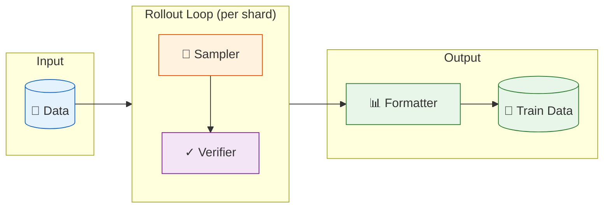

# Rejection Sampling Recipes

**Reproducible recipes for rejection sampling in synthetic data generation.**

## Why RSR?

The community already has great tools for inference (vLLM, SGLang), training (LLaMA-Factory, veRL), and evaluation (lm-eval-harness). But when it comes to **rejection sampling / Best-of-N** for distillation or RL data curation, most of us end up writing one-off scripts.

RSR handles the trivial-but-important details:

- **Truncation detection** — Detects and discards truncated responses
- **Smart early stopping** — Stop sampling once you have what you need
- **Checkpoint & resume** — Shard-based storage for large-scale sampling
- **Quality stats** — Pass rates, token distributions, saved automatically

## Core Concepts

### Pipeline Flow



### Components

| Component | Description | Options |
|-----------|-------------|---------|
| **Sampler** | Generates responses from LLM | `vllm-offline`, `openai-compatible-api` |
| **Verifier** | Scores responses against ground truth | `mcq-rlvr`, `mcq-llm-as-judge`, `math-rlvr` |
| **Formatter** | Converts scored rollouts to training data | `sft`, `dpo`, `multi_sft` |

### Data Flow

```
Input (prompts + metadata)
    ↓
┌─────────────────────────────┐
│  Sampling Loop (per prompt) │
│  ┌────────────────────────┐ │
│  │ Step 1: sample N       │ │
│  │ Step 2: verify scores  │ │
│  │ Step 3: check early    │◀┤── repeat until satisfied
│  │         stop condition │ │     or max_steps reached
│  └────────────────────────┘ │
└─────────────────────────────┘
    ↓
Rollouts (responses + scores)
    ↓
Formatter → Training Data (SFT/DPO/Multi-SFT)
```

## Output Structure

```
output/20251206_143052/
├── config.yaml          # Experiment config (auto-saved)
├── state.json           # Progress & checkpoint state
├── data/
│   └── input.jsonl      # Preprocessed input data
├── rollout/             # Rollout results (sharded)
│   ├── shard_0000.jsonl
│   └── ...
├── train/               # Training-ready data
│   ├── sft.jsonl
│   └── dpo.jsonl
└── summary/
    └── stats.json       # Quality statistics
```

## Next Steps

- [Getting Started](getting-started.md) — Run your first sampling job
- [Configuration](configuration.md) — Full parameter reference
- [Recipes](recipes.md) — SFT, DPO, Multi-SFT workflows
- [Early Stop](early-stop.md) — Smart sampling termination
- [Reliability](reliability.md) — Truncation handling & checkpoints
